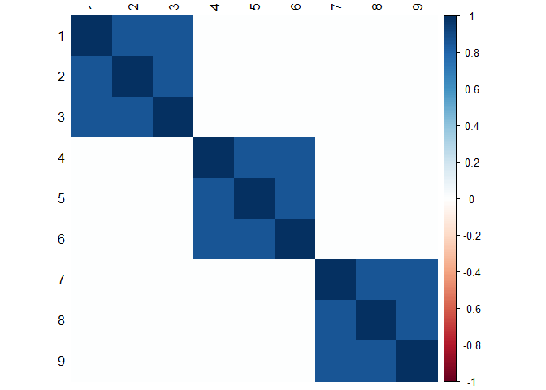
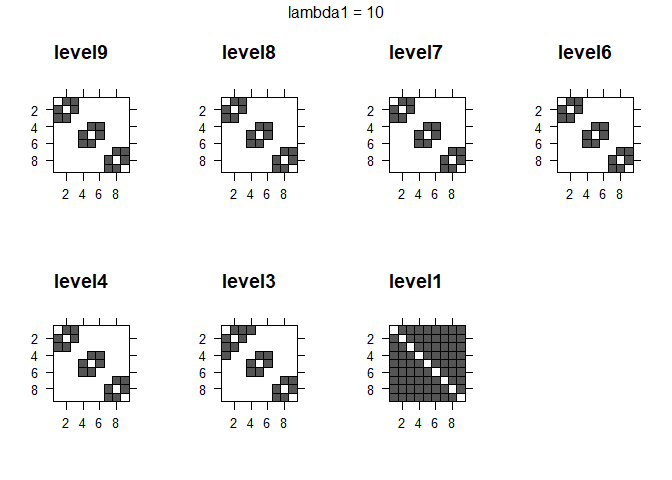

<!-- badges: start -->

[](https://github.com/desanou/mglasso/actions/workflows/basic.yml)
[](https://www.repostatus.org/#active)
[](https://lifecycle.r-lib.org/articles/stages.html#maturing-1)
<!-- [](https://CRAN.R-project.org/package=mglasso) -->
<!-- [](https://CRAN.R-project.org/package=mglasso) -->
<!-- badges: end -->

<!-- README.md is generated from README.Rmd. Please edit that file -->

## Method

This repository provides an implementation of the `MGLasso` (Multiscale
Graphical Lasso) algorithm: an approach for estimating sparse Gaussian
Graphical Models with the addition of a group-fused Lasso penalty.

`MGLasso` is described in the paper [Inference of Multiscale Gaussian
Graphical Model](https://desanou.github.io/multiscale_glasso/).
`MGLasso` has these contributions:

- We simultaneously infer a network and estimate a clustering structure
  by combining the [neighborhood
  selection](https://arxiv.org/abs/math/0608017) approach (Meinshausen
  and Bühlman, 2006) and [convex
  clustering](https://www.di.ens.fr/~fbach/419_icmlpaper.pdf) (Hocking
  et al. 2011).

- We use a continuation with Nesterov smoothing in a
  shrinkage-thresholding algorithm
  ([`CONESTA`](https://arxiv.org/abs/1605.09658), Hadj-Selem et
  al. 2018) to solve the optimization problem.

To solve the `MGLasso` problem, we seek the regression vectors

that minimize

 =  \frac{1}{2}  \sum_{i=1}^p  \left \lVert  \mathbf{X}^i - \mathbf{X}^{\setminus i} \boldsymbol{\beta}^i  \right \rVert_2 ^2 +  \lambda_1  \sum_{i = 1}^p  \left \lVert  \boldsymbol{\beta}^i \right \rVert_1 +  \lambda_2  \sum_{i < j}  \left \lVert  \boldsymbol{\beta}^i - \tau_{ij}(\boldsymbol{\beta}^j)  \right \rVert_2.")

`MGLasso` package is based on the python implementation of the solver
`CONESTA` available in
[pylearn-parsimony](https://github.com/neurospin/pylearn-parsimony)
library.

## Package requirements and installation

- Install the `reticulate` package and Miniconda if no conda
  distribution available on the OS.

``` r
install.packages('reticulate')
reticulate::install_miniconda()
```

- Install `MGLasso`, its python dependencies and configure the conda
  environment `rmglasso`.

``` r
# install.packages('mglasso')
remotes::install_github("desanou/mglasso")
```

``` r
library(mglasso)
install_pylearn_parsimony(envname = "rmglasso", method = "conda")
#> + "C:/Users/doedm/AppData/Local/r-miniconda/condabin/conda.bat" "install" "--yes" "--name" "rmglasso" "python=3.8"
reticulate::use_condaenv("rmglasso", required = TRUE)
reticulate::py_config()
#> python:         C:/Users/doedm/AppData/Local/r-miniconda/envs/rmglasso/python.exe
#> libpython:      C:/Users/doedm/AppData/Local/r-miniconda/envs/rmglasso/python38.dll
#> pythonhome:     C:/Users/doedm/AppData/Local/r-miniconda/envs/rmglasso
#> version:        3.8.13 (default, Mar 28 2022, 06:59:08) [MSC v.1916 64 bit (AMD64)]
#> Architecture:   64bit
#> numpy:          C:/Users/doedm/AppData/Local/r-miniconda/envs/rmglasso/Lib/site-packages/numpy
#> numpy_version:  1.22.4
#> conesta_solver: [NOT FOUND]
#> 
#> NOTE: Python version was forced by use_python function
```

The `conesta_solver` is delay loaded. See `reticulate::import_from_path`
for details.

An example of use is given below.

## Illustration on a simple model

### Simulate a block diagonal model

We simulate a
-block
diagonal model where each block contains

variables. The intra-block correlation level is set to

while the correlations outside the blocks are kept to
.

``` r
library(Matrix)
n = 50
K = 3
p = 9
rho = 0.85
blocs <- list()

for (j in 1:K) {
  bloc <- matrix(rho, nrow = p/K, ncol = p/K)
  for(i in 1:(p/K)) { bloc[i,i] <- 1 }
  blocs[[j]] <- bloc
}

mat.correlation <- Matrix::bdiag(blocs)
corrplot::corrplot(as.matrix(mat.correlation), method = "color", tl.col="black")
```


#### Simulate gaussian data from the covariance matrix

``` r
set.seed(11)
X <- mvtnorm::rmvnorm(n, mean = rep(0,p), sigma = as.matrix(mat.correlation))
colnames(X) <- LETTERS[1:9]
```

### Run `mglasso()`

We set the sparsity level

to

and rescaled it with the size of the sample.

``` r
X <- scale(X)    
res <- mglasso(X, lambda1 = 0.2*n, lambda2_start = 0.1, fuse_thresh = 1e-3, verbose = FALSE)
```

To launch a unique run of the objective function call the `conesta`
function.

``` r
temp <- mglasso::conesta(X, lam1 = 0.2*n, lam2 = 0.1)
```

#### Estimated clustering path

We plot the clustering path of `mglasso` method on the 2 principal
components axis of
.
The path is drawn on the predicted
’s.

``` r
library(ggplot2)
library(ggrepel)
mglasso:::plot_clusterpath(as.matrix(X), res)
```



#### Estimated adjacency matrices along the clustering path

As the the fusion penalty increases from `level9` to `level1` we observe
a progressive fusion of adjacent edges.

``` r
plot_mglasso(res)
```



## Reference

Edmond, Sanou; Christophe, Ambroise; Geneviève, Robin; (2022): Inference
of Multiscale Gaussian Graphical Model. ArXiv. Preprint.
<https://doi.org/10.48550/arXiv.2202.05775>
