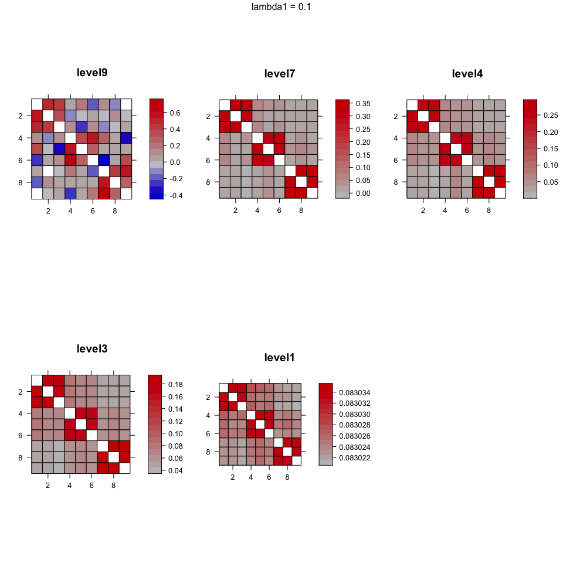

[](https://github.com/desanou/mglasso/actions/workflows/basic.yml)

<!-- README.md is generated from README.Rmd. Please edit that file -->

## Installation

``` r
remotes::install_github("desanou/mglasso")
library(mglasso)
```

``` r
library(mglasso)
#> Checking if miniconda is installed...
#> Using virtual environment 'r-reticulate' ...
```

## Basic Usage

1.  Simulate some block diagonal model

``` r
library(Matrix)
n = 50
K = 3
p = 9
rho = 0.85
blocs <- list()

for (j in 1:K) {
  bloc <- matrix(rho, nrow = p/K, ncol = p/K)
  for(i in 1:(p/K)) { bloc[i,i] <- 1 }
  blocs[[j]] <- bloc
}

mat.covariance <- Matrix::bdiag(blocs)
Matrix::image(mat.covariance)
```


1.1 True cluster parition

``` r
rep(1:3, each = 3)
#> [1] 1 1 1 2 2 2 3 3 3
```

2.  Simulate gaussian data from the covariance matrix

``` r
set.seed(11)
X <- mvtnorm::rmvnorm(n, mean = rep(0,p), sigma = as.matrix(mat.covariance))
```

2.  Launch algorithm

``` r
X <- scale(X)    
res <- mglasso(X, lambda1 = 0.1, lambda2_start = 0.1, fuse_thresh = 1e-3)
#> [1] 0.1
#> nclusters = 9 lambda2 0 cost = 85.41681 
#> [1] 0.1
#> nclusters = 9 lambda2 0.1 cost = 85.73135 
#> [1] 0.1
#> nclusters = 9 lambda2 0.15 cost = 85.98468 
#> [1] 0.1
#> nclusters = 9 lambda2 0.225 cost = 86.45846 
#> [1] 0.1
#> nclusters = 9 lambda2 0.3375 cost = 87.3288 
#> [1] 0.1
#> nclusters = 9 lambda2 0.50625 cost = 88.86085 
#> [1] 0.1
#> nclusters = 9 lambda2 0.759375 cost = 91.41304 
#> [1] 0.1
#> nclusters = 9 lambda2 1.139063 cost = 95.42646 
#> [1] 0.1
#> nclusters = 9 lambda2 1.708594 cost = 101.5021 
#> [1] 0.1
#> nclusters = 9 lambda2 2.562891 cost = 111.5274 
#> [1] 0.1
#> nclusters = 7 lambda2 3.844336 cost = 130.5629 
#> [1] 0.1
#> nclusters = 4 lambda2 5.766504 cost = 170.3529 
#> [1] 0.1
#> nclusters = 3 lambda2 8.649756 cost = 254.4898 
#> [1] 0.1
#> nclusters = 1 lambda2 12.97463 cost = 380.9522 
#> niter ==  14
```

3.  Plot results compact version

3.1 Estimated regression vectors

``` r
mglasso::plot.mglasso(res)
```



`level9` denotes a partition with `9` clusters. We observe a shrinkage
effect in the estimated coefficients due to the fuse-group lasso penalty
parameter.

3.2 Estimated clustering partitions

``` r
res$out$level9$clusters
#> [1] 1 2 3 4 5 6 7 8 9
res$out$level7$clusters
#> [1] 1 2 3 4 5 6 7 7 7
res$out$level4$clusters
#> [1] 1 1 1 2 3 2 4 4 4
res$out$level3$clusters
#> [1] 1 1 1 2 2 2 3 3 3
res$out$level1$clusters
#> [1] 1 1 1 1 1 1 1 1 1
```

The uncovered partition obtained while increasing *λ*<sub>2</sub> is a
hierarchical partition under some constraints.

# Reference

Inference of Multiscale Gaussian Graphical Model, preprint
